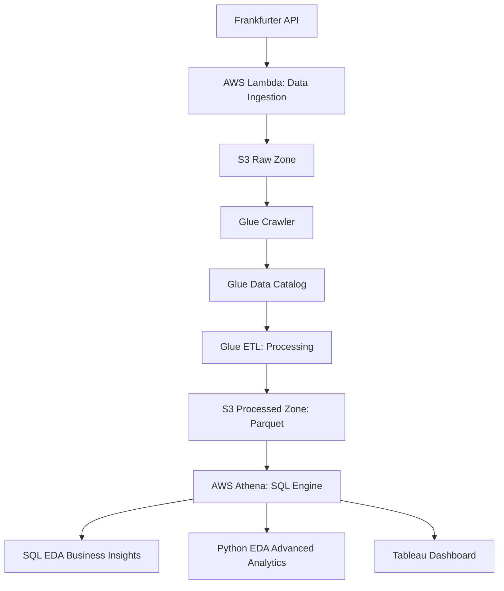

#  Currently Analytics Platform

A cloud-native AWS pipeline that transforms raw foreign exchange data into actionable trading insights and risk intelligence.


[](https://aws.amazon.com)
[](https://python.org)
[](https://tableau.com)

## 📊 Live Dashboard

**👉 [View Interactive Tableau Dashboard](https://public.tableau.com/views/CurrencyAnalyticsPlatform/CurrencyAnalyticsPlatform)**

## 🎯 Overview

This platform automates currency analysis by providing traders, analysts, and portfolio managers with real-time, data-driven analytics through a fully automated serverless AWS pipeline.

### Key Features

- **Automated Data Ingestion**: Daily currency data collection from Frankfurter API
- **Advanced Analytics**: SQL & Python EDA engines for comprehensive insights
- **Risk Intelligence**: Volatility analysis, correlation mapping, and forecasting
- **Interactive Visualization**: Tableau dashboards with 6 integrated worksheets
- **Serverless Architecture**: Fully automated, cost-effective AWS pipeline

## 🏗️ System Architecture


    
### Technology Stack
| Layer | Technology | Purpose |
|-------|------------|---------|
| **Ingestion** | AWS Lambda (Python) | Daily API data collection |
| **Storage** | Amazon S3 | Data Lake (Raw & Processed) |
| **Processing** | AWS Glue (Spark) | ETL & Metric Calculation |
| **Catalog** | AWS Glue Catalog | Schema Management |
| **Crawlers** | AWS Glue Crawlers | Auto-discover Raw Data Schema |
| **Query** | AWS Athena | SQL Analytics Engine |
| **Scheduling** | EventBridge | Automated Daily Pipeline |
| **Visualization** | Tableau | Interactive Dashboards |

## 📈 Key Analytical Findings

### 🔴 Critical Risks Identified
- **Extreme Volatility**: TRY, BRL, MXN form high-risk cluster
- **Unusual Behavior**: JPY exhibiting atypical volatility for major currency
- **Regional Risk Clusters**: Latin American currencies show high internal correlation

### 💹 Trading Opportunities
- **Monday Effect**: Strongest trading day (+0.036% avg return)
- **Friday Weakness**: Worst day (-0.007% avg return) - avoid new positions
- **Best Risk-Adjusted Returns**: CAD and SGD offer stability & favorable returns

### 🌐 Market Patterns
- **Asian Block Correlation**: SGD, HKD, CNY, INR highly correlated (>0.8)
- **Regional Linkages**: High inter-region correlations reduce geographic diversification effectiveness

## 🗂️ Project Structure

```
currency-analytics-platform/
├── src/
│   ├── lambda/
│   │   ├── currency_data_ingestion.py 
│   │   └── python_eda_analysis.py
│   ├── glue/
│   │   └── currency_data_processing.py
│   └── sql/
│       └── exploratory_analysis_queries.sql
├── infrastructure/
│   ├── iam_roles_documentation.md
│   ├── glue_crawler_configuration.md
│   └── eventbridge_scheduler.md
├── docs/
│   └── final_capstone_report.pdf
├── README.md
├── requirements.txt
└── .gitignore
```

## 🚀 Quick Start

### Prerequisites
- AWS Account with appropriate permissions
- Python 3.9+
- Tableau Desktop (for local visualization)

### Installation

1. **Clone Repository**
   ```bash
   git clone https://github.com/AnushaShankar17/currency-analytics-platform.git
   cd currency-analytics-platform
   ```

2. **Install Python Dependencies**
   ```bash
   pip install -r requirements.txt
   ```

3. **AWS Infrastructure Setup**
   - Deploy IAM roles (see `infrastructure/iam_roles_documentation.md`)
   - Create S3 buckets for raw and processed data
   - Set up Glue Crawler and ETL jobs
   - Configure EventBridge scheduler

### Pipeline Execution

1. **Data Ingestion** (Daily at 16:00 CET)
   - Lambda function fetches data from Frankfurter API
   - Stores JSON files in S3 Raw Zone

2. **Data Processing** (Automated)
   - Glue Crawler catalogs raw data
   - Glue ETL job processes data, calculates metrics
   - Outputs optimized Parquet files to S3 Processed Zone

3. **Analytics Execution**
   - SQL EDA: Core business insights via Athena
   - Python EDA: Advanced statistical analysis
   - Tableau: Interactive visualization

## 📊 Tableau Dashboard

The platform features an interactive Tableau dashboard with 6 integrated worksheets:

### Worksheets:
1. **Currency Performance Grid** - Current market snapshot
2. **Exchange Rate Trends** - Historical analysis
3. **Volatility Ranking** - Risk assessment
4. **Risk-Return Scatter Plot** - Investment support
5. **Moving Average Crossover** - Technical analysis
6. **Quarterly Performance Heatmap** - Seasonal analysis

### Dashboard Features:
- **KPI Summary**: Active currencies, market sentiment, data currentness
- **Interactive Filtering**: Cross-filtering across all worksheets
- **Real-time Updates**: Live connection to AWS Athena

## 🔧 Configuration

### AWS Services Configuration
- **S3 Buckets**: `currency-analytics-ganit-project`
- **Glue Database**: `currency_analytics_db`
- **Athena Database**: `currency_analytics_processed`
- **Lambda Functions**: 
  - `CurrencyDataIngestion`
  - `currency-python-eda1`

### IAM Roles
- `CurrencyPythonEDARole` - Python EDA Lambda permissions
- `CurrencyDataSchedulerRole` - EventBridge scheduler permissions  
- `CurrencyAnalyticsLambdaRole` - Data ingestion Lambda permissions
- `CurrencyAnalyticsGlueRole` - Glue ETL permissions

## 📋 SQL EDA Queries

The platform includes comprehensive SQL analysis:

- **Basic Data Overview**: Record counts, date ranges, averages
- **Volatility Ranking**: Top 10 most volatile currencies
- **Performance Analysis**: Day-of-week effects, monthly trends
- **Correlation Analysis**: Currency relationships and regional blocks
- **Cluster Analysis**: Market segmentation and diversification insights

## 🐍 Python EDA Features

Advanced statistical analysis includes:

- **Volatility Risk Assessment** with risk level classification
- **Performance Matrix** with Sharpe ratio calculations
- **Correlation Clusters** identifying strongly linked currencies
- **Time Series Forecasting** using weighted moving averages
- **Comprehensive Reporting** with text visualizations

## 💡 Business Applications

### For Risk-Averse Investors
- Focus on CAD, SGD, DKK (low volatility, stable returns)
- Avoid TRY, BRL, MXN (extreme volatility)
- Monitor JPY (unusual behavior)

### For Active Traders
- Monday Morning Strategy: Capitalize on week's positive start
- Regional Arbitrage: Exploit Latin American-North American correlations
- Friday Protection: Implement hedging for weekend risk

### For Portfolio Managers
- Currency-specific selection over geographic diversification
- Asian developed currencies for stability
- Daily volatility checks on emerging market exposures

## 📄 Documentation

- **[Full Capstone Report](docs/final_capstone_report.pdf)** - Comprehensive project documentation
- **Infrastructure Setup** - Detailed AWS configuration guides
- **SQL Query Reference** - Complete analytics query library
- **Tableau Connection Guide** - Dashboard setup instructions

## 🤝 Contributing

1. Fork the repository
2. Create a feature branch (`git checkout -b feature/amazing-feature`)
3. Commit your changes (`git commit -m 'Add amazing feature'`)
4. Push to the branch (`git push origin feature/amazing-feature`)
5. Open a Pull Request

## 📝 License

This project is licensed under the MIT License

## 👥 Authors

- **Anusha Shankar** - *Initial work* - [AnushaShankar17](https://github.com/AnushaShankar17)

## 🙏 Acknowledgments

- Frankfurter API for currency data
- AWS for cloud infrastructure
- Tableau for visualization capabilities
